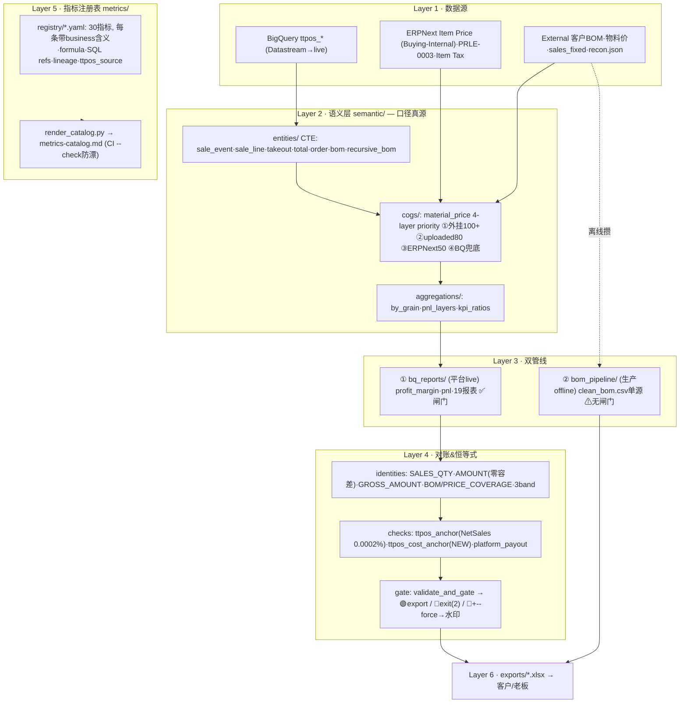
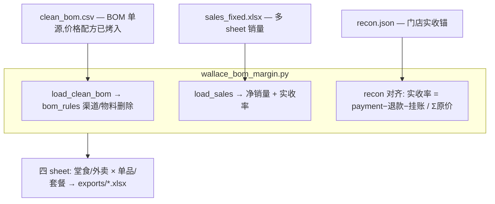

# 数据架构全景 — 华莱士分析工作区

> 从数据源到导出，六层架构逐层展开。**每个口径都有 ttpos 源码溯源**。

## 0. 六层全貌



## 1. 双管线一句话区分

| | ① semantic / bq_reports | ② bom_pipeline |
|---|---|---|
| **定位** | 平台底座(可审计、对账中台、指标平台) | 当前生产交付(`《商品成本毛利分析》`) |
| **数据源** | BQ live + ERP/外挂 real-time | `clean_bom.csv` 单源(离线攒,价格已烤入) |
| **成本价格** | material_price 4-layer priority + Buying-Internal + desired-UOM | clean_bom 冻存的 base×1.05×(1+tax) |
| **实收锚** | Net Sales = ttpos actual_amount(应收),恒等式待复核 | payment−退款−挂账 = 门店汇总实收(已对齐) |
| **闸门** | ✅ gated(恒等式不通过 block export) | ⚠ 无闸门 |
| **对账锚** | ttpos_anchor(NetSales 0.0002%) + ttpos_cost_anchor(待sid) | 靠 recon.json 实收对齐 |

## 2. 语义层 & 成本解析

### 2.1 业务实体 CTE 工厂 (`semantic/entities/`)

| 实体 | BQ 源表 | 粒度 | 用途 |
|---|---|---|---|
| `sale_event` | statistics_product + takeout_order_item | (item, price, channel) | 最细事实表,含 actual_amount |
| `sale_line` | statistics_product | (item) | 旧粒度,profit_margin 等消费 |
| `takeout_line` | takeout_order_item | (item) | 外卖,按 state 过滤取消 |
| `total_line` | sale_line FULL JOIN takeout_line | (item) | 合并表 |
| `order_line` | sale_order_product + takeout_order | (order × item) | 套餐子品拆解 + 凭证账 |
| `order_discount` | statistics_product + sale_order | (item_uuid) | 7 项订单折扣分摊 |
| `bom` / `combo` / `recursive_bom` | product_bom + package_group + group_item + related_material | (combo × material) | 套餐"订单→子品→物料"递归拆解 |

- `recursive_bom` = 套餐成本**唯一真源**:可选组按订单真实选择展开,禁摊销 weight=optional_count/candidate_count(踩坑 v6~v15)
- `order_discount` = 实收拆分真源: 应收(actual_amount) − coupon+member+activity+custom+rounding+gift+pay_points

### 2.2 物料单价五层 priority 栈 (`semantic/cogs/material_price.py`)

```
L1 客户外挂 price_layers · priority 100+  →  index_by: code/name, value: float/{price,source_tag}
L2 uploaded_prices · priority 80           →  --price-list 上传清单, 按编码精确匹配
L3 ERPNext Buying-Internal · priority 50   →  desired-UOM 选行, mismatch→跳过→兜底 (NEW · 2026-06 对齐 ttpos)
L4 BQ ttpos_material 兜底                  →  per-row bq_price (全0,实际无用)
```

- `strict=True` = 只走 L1,未命中 → `(0, '无(strict)')`,客户没维护的物料按 0 成本。
- 审计列 `price_source` 可见真实命中层,`SOURCE_COVERAGE` identity 报警 missing。

### 2.3 ERP 价格对齐 (2026-06 完成, `feature/erp-cost-ttpos-alignment`)

ttpos Go 真源 (`business_cost_profit_erp_cost.go:103` priceList=`"Buying - Internal"`, `item.go:107 GetItemUnitCost`):

| 维度 | 修正前 | 修正后 |
|---|---|---|
| 价表 | Standard Buying (错表) | Buying - Internal → `erpnext_api.py` |
| 字段 | 403 回退 Item.last_purchase_rate | Item Price.price_list_rate |
| UOM | 写死 g>pc>nos 优先级 + 消费侧丢弃 _uom | desired-UOM 选行 + material_price 校验 |
| margin | 无条件 ×1.05 | PRLE-0003 条件: buying & !disabled & for_price_list & PriceOrDiscount & dates |
| 税 | 适用税率% (来源未验) | Item Tax 税率 (留子集,单一 VAT 等价) |

对账锚: `semantic/reconciliation/checks/ttpos_cost_anchor.py`(5 guard 完整复刻,可注入 erp_get, 待接 sid live)。
Phase 5: 修正算法 vs v40, 在假设 PRLE-0003 条件满足时**算法差异=0**(仅 ฿28.56 舍入差)。

## 3. 对账 & 恒等式体系 (`semantic/validators/` + `reconciliation/`)

### 3.1 闸门级恒等式 (不通过 block export)

| Identity | 阈值 | 说明 |
|---|---|---|
| SALES_QTY | abs≤1, rel≤0.1% | 销量从多个实体汇总必须 self-consistent |
| AMOUNT | abs≤1 satang, rel≤0.1% | 金额恒等式,零容差(int 化后) |
| GROSS_AMOUNT | abs≤1 satang, rel≤0.1% | 毛额守恒 |
| BOM_SOURCE_COVERAGE | missing≤20% | BOM 来源完整性 |
| PRICE_SOURCE_COVERAGE | missing≤50% | 物料单价来源完整性 |

### 3.2 合理性区间 (soft, 不 block)

| Band | 阈值 | 说明 |
|---|---|---|
| REFUND_RATIO | ≤X% | 退款率合理性 |
| FREE_GIVE_RATIO | ≤Y% | 赠品/赠送率合理性 |
| CANCEL_RATIO | ≤Z% | 外卖取消率合理性 |

### 3.3 跨系统对账 (reconciliation checks)

| Check | 对什么 | 状态 |
|---|---|---|
| `ttpos_anchor` | BQ Net Sales vs ttpos 后端 SQL | 2026-04 差 0.0002% ✅ |
| `ttpos_cost_anchor` | BQ COGS vs ERP 复算 ttpos 算法 | **NEW** (5 guard 完整复刻,待 sid live) |
| `platform_payout` | 外卖营收 vs Grab/LINE MAN 对账单 | 框架就绪,待 loader |

### 3.4 观察模式 (不进闸门, 定期审视)

| 项 | 状态 | 说明 |
|---|---|---|
| CROSS_LEDGER | qty 89.5%, 结构天花板 | voucher vs stat 后端写入不对称, ~10% 不可控残差不进闸门 |
| PAYMENT_TIEOUT | 半覆盖 | payment_amount 仅含堂食 POS, 外卖待平台对账单 |

### 3.5 导出闸门 (gate)

```python
validate_and_gate(check_rows, FULL_IDENTITIES)
# 🟢 全绿 → export Excel
# 🔴 有红 → exit(2), NO file
# 🔴 + --force → 水印 "⚠️校验未通过"
```

无闸门脚本 → `test_validator_coverage.py` AST 扫描 → CI block。

非销售类导出(如 BOM/菜单)用 `make_required_fields_identity` / `make_unique_key_identity` 基线。

## 4. 指标注册表 (`semantic/metrics/`)

### 4.1 结构

```
semantic/metrics/registry/
├── sales.yaml      15 指标 (含 receivable/net_revenue + 支付三口径)
├── settlement.yaml  2 指标 (platform_commission / contribution_margin)
├── finance.yaml     5 指标 (labor/rent/utilities/marketing/operating_income)
├── kpi.yaml         6 指标 (gross_margin/food_cost/prime_cost/aov/channel_mix/take_rate)
└── metadata.yaml    2 指标 (bom_source / price_source)
────────────────────────────────────────────────
                   30 指标, 每条带 ttpos_source 溯源
```

每条指标 = `id` + `name` + `definition` + `formula`(business + SQL refs) + `lineage`(source_tables + upstream/downstream) + `reconciliation`(anchor + impl + status) + `ttpos_source`(Go file:line / BQ table.field) + `confidence`(ACTUAL / ESTIMATED / NA)

### 4.2 支付口径拆分 (关键, 防客户喊"数据错")

| 指标 | 含义 | ttpos 对应 |
|---|---|---|
| `turnover` (营业额) | 成本表口径 = receivable + takeout subtotal | CountProductSales + CountTakeoutSale(subtotal) |
| `receivable` (应收) | = actual_amount,已扣行级折扣,未扣订单级折扣 | CountProductSale.actual_sale_amount |
| `net_revenue` (实收) | = receivable − 7 项订单折扣 | receivable − sale_order 营销减项 |
| `payment_collected` (支付净额) | 汇总表口径 = payment−refund−balance + platform_total | CountSale + CountTakeoutSale(platform_total) |
| `bank_deposited` (实际到账) | 银行流水 / 平台结算单 | **外部**(银行·Grab·LINEMAN), 非 ttpos |

桥关系(已验证, `scripts/adhoc/recon_cost_vs_summary_bridge.py`):

```
turnover − payment_collected ≈ coupon + other_disc − refund_gap + takeout_gap (残差抹零级)
```

改口径只改 yaml → `venv/bin/python -m semantic.metrics.render_catalog` → CI `--check` 防文档漂移。
代码改了 registry 没同步 → CI block。

## 5. ② bom_pipeline 生产口径的指标谱系

### 5.1 运行流程



### 5.2 指标计算公式

| Excel 列 | 指标 | 公式 | 源 |
|---|---|---|---|
| K | 净销量 | 销量表 `qty`(qty>0) | sales |
| L | 实收金额 | `round(原价 amt × 实收率 rate)` | sales × recon |
| N | 单份总成本 | `Σ(消耗数量 × 物料单价)` | clean_bom |
| O | 总毛利 | `L − N×K` | 派生 |
| B | 毛利率 | `IF(L=0, 0, O/L)` | 派生 |

> "净"系列列 (M 净利润 / P 净总毛利 / C 净毛利率) 当前等于对应毛列, 是给后续扣平台抽佣/税预留的位。

### 5.3 clean_bom.csv 谱系

```
ERP (ERPNext) → 初版全量 BOM → 反复人工纠正(历代 xlsx, 已归档 exports/_archive/)
    → resources/wallace.20260626/clean_bom.csv (4466 行, 14 列)
```

配方来自 ERP, 价格来自 `erpnext_price.py` 复刻 `calculateFinalItemUnitCost`(base × 1.05 × 1.07)。
过程非线性, 归档 xlsx + git history 可回溯。新月份应从 ERP 重新 load, 不手工改历史 xlsx。

## 6. 文件结构速查

```
semantic/entities/       — SQL CTE 工厂 (12 实体)
semantic/cogs/           — 成本解析 (material_price + bom_match + item_cogs)
semantic/aggregations/   — 聚合 (by_grain + pnl_layers + kpi_ratios)
semantic/validators/     — 恒等式 + 闸门 + gate
semantic/reconciliation/ — 跨系统对账 (ttpos_anchor + cost_anchor + platform_payout)
semantic/metrics/        — 指标注册表 + catalog 自动生成
bq_reports/              — 19 份报表脚本 (平台管线入口)
bom_pipeline/            — 生产管线 (wallace_bom_margin + erpnext_price + bom_rules)
utils/                   — 通用 (report_engine + cache + resource_adapter)
resources/               — 活配置 (config.yaml) + wallace.{date}/ 归档
scripts/adhoc/           — 一次性排查/对账/审计脚本
tests/                   — 584 测试 (unittest + AST 扫描)
```

## 7. 相关文档

- `docs/metrics-catalog.md` — 30 指标完整目录 (自动生成)
- `docs/superpowers/plans/2026-06-26-erp-cost-ttpos-alignment.md` — ERP 价格对齐实现计划
- `docs/bom-pipeline.md` — ② 生产管线完整说明 (含 §1.5 数据源谱系)
- `docs/bq-schema-reference.md` — BQ 表结构
- `docs/ttpos-bq-field-pitfalls.md` — BQ 字段陷阱
- `docs/ttpos-algorithms-mirror.md` — ttpos 算法 BQ 镜像
- `docs/audit/2026-06-cross-ledger-baseline.md` — 跨账本基线
- `docs/pnl-statement-design.md` — P&L 设计
- `docs/profit-report-takeout-semantics.md` — 外卖口径归档
- `semantic/metrics/registry/*.yaml` — 指标真源 (改口径只改这里)
