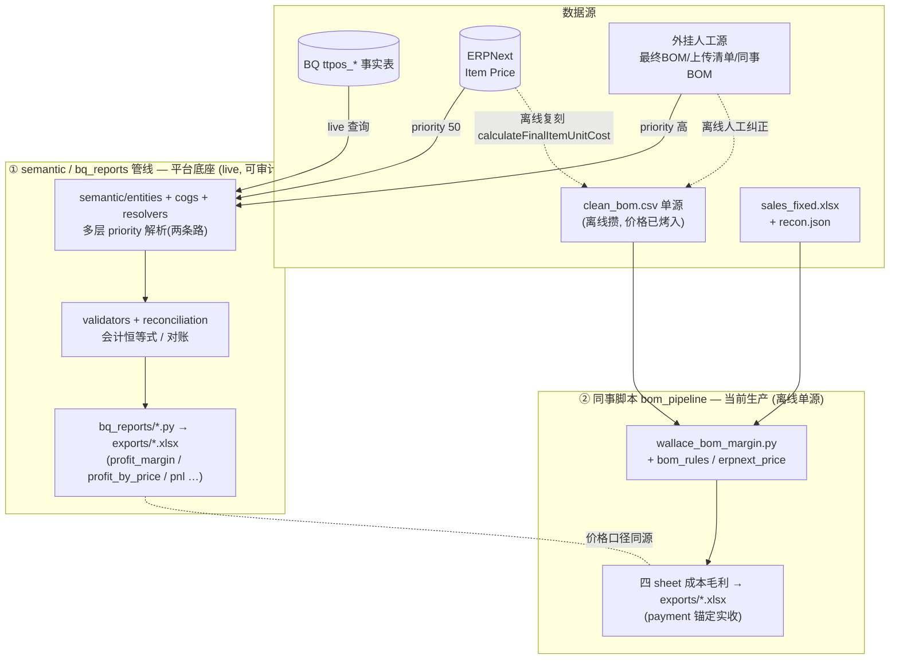
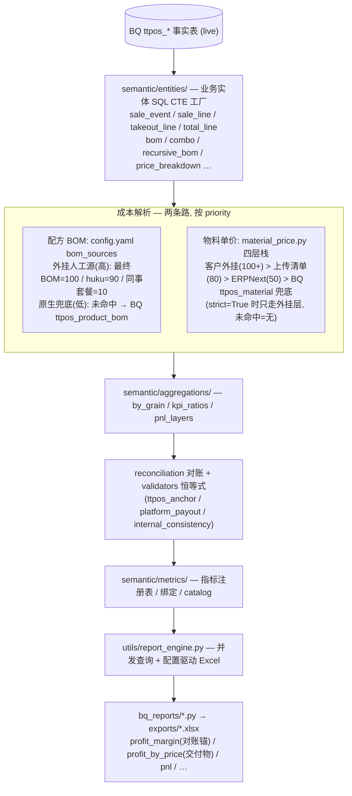
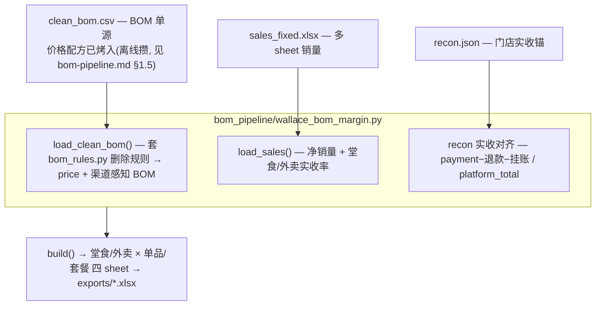
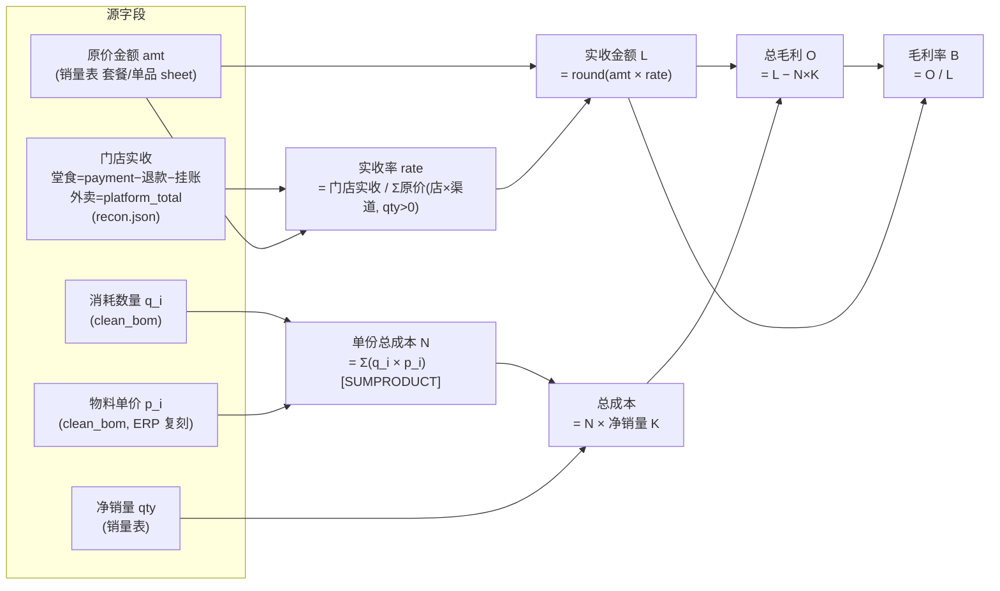

# 两套管线全景图 — semantic 平台层 vs 同事脚本生产线

> 华莱士成本毛利/报表工作区里**并存两套管线**，目标重叠（都算成本毛利）但定位、数据源、
> 运行方式完全不同。这份文档理清它们各是什么、谁负责什么、关系如何，避免把两者混为一谈。

## 0. 全景

## 1. 一句话区分

| | ① semantic / bq_reports | ② 同事脚本（bom_pipeline） |
|---|---|---|
| **定位** | 平台底座 / 未来方向（可审计、对账中台、指标平台） | **当前生产交付**（《商品成本毛利分析》） |
| **数据源** | 实时读 BQ（`ttpos_*` 事实表）+ ERP/外挂 | 离线攒好的 `clean_bom.csv` 单源 + 销量 xlsx + recon |
| **运行时** | live 查询 + 多层 priority 解析 | 读拍平的单源，**不碰 BQ/ERP** |
| **"两条路"数据源** | ✅ 在这（外挂人工源 覆盖 ERP/BQ 原生） | ❌ 运行时单源（两条路只发生在离线攒 csv 时） |
| **实收口径** | 实收恒等式待复核（遗留 158） | payment 锚定，已对齐同事/门店汇总（生产） |
| **状态** | 成本毛利交付物 `combo_bom_detail` 搁置（口径未定稿） | 生产口径走这套 |

## 2. ① semantic / bq_reports 管线

我们自己的语义平台层。强调**可审计、配置驱动、口径收口**。

特点：**live、多层覆盖、带校验与对账**。所谓"两条路"（外挂人工源 vs ERP/BQ 原生，
高优先覆盖低优先兜底）就是这套里的 priority 解析机制。

## 3. ② 同事脚本管线（bom_pipeline）

当前《商品成本毛利分析》的生产口径。强调**单源、payment 锚定实收、跟同事逐店对齐**。

> `erpnext_price.py` 不在运行时图里 —— 它是**离线攒 clean_bom 价格列**时复刻 ERP 终价的算法。

特点：**运行时单源、不查 BQ/ERP、快而稳**。两条路只发生在**离线攒 `clean_bom.csv`** 的阶段
（ERP 直接 load + 反复人工纠正），运行时已经拍平成一张表。

## 4. 指标计算谱系（② 生产口径，每个数字怎么算出来的）

下面是 ② 四 sheet 报表里**每个输出列**的真实算法（抠自 `wallace_bom_margin.py` `build()`）。
先看字段级推导图，再看逐列公式表。

逐列公式（Excel 列号 = 报表实际列；公式列写的是单元格真公式）：

| 列 | 指标 | 公式 | 源 / 说明 |
|---|---|---|---|
| K | 净销量 | 销量表净销量 `qty` | sales（qty≤0 行跳过） |
| L | **实收金额** | `round(原价 amt × 实收率 rate)` | sales × recon。实收率 = 门店实收 ÷ Σ原价(该店该渠道) |
| M | 净利润 | `= L` | **当前等于实收**（预留位，未扣平台抽佣/税） |
| N | **单份总成本** | `SUMPRODUCT(消耗数量, 物料单价)` = Σ(q_i×p_i) | clean_bom；物料单价 = ERP 复刻终价 |
| O | **总毛利** | `= L − N×K`（实收 − 单份成本×净销量） | 派生 |
| P | 净总毛利 | `= O` | **当前等于总毛利**（预留位） |
| B | **毛利率** | `= IF(L=0,0, O/L)` = 总毛利 / 实收 | 派生 |
| C | 净毛利率 | `= B` | 当前等于毛利率（预留位） |

明细行（每个物料一行）：H=消耗数量、I=物料单价、F=物料名、G=编码、J=单位；
N 列就是对这些 H×I 求 SUMPRODUCT。

**两个要点（避免误读）**：
- **`净` 系列列（M 净利润 / P 净总毛利 / C 净毛利率）当前 = 对应毛列**，是给后续扣平台抽佣/税
  预留的位，现阶段没扣，所以数值一样。别把 M「净利润」当真利润 —— 它现在就是实收 L。
- **无 BOM 的商品**：成本走估算 `成本 = round(实收 × 该 sheet 已匹配商品平均成本率)`，
  并在物料名标「(估算·未映射)」。这类不进上面的 SUMPRODUCT 链。

> ① 管线的成本谱系不同：成本 = 逐组分 `Σ(组分消耗 × 料价)`，料价走四层 priority resolver（live），
> 套餐按订单真实拆解（`semantic/entities/recursive_bom.py`，禁摊销）。同样产出 实收/成本/毛利/毛利率，
> 但每个量的取数路径是 live 多层，不是这张离线单源表。

## 5. 关系与分工

- **目标重叠**：两套都产出"成本毛利"，口径理论同源（成本都基于 ERP 复刻的物料采购价
  `calculateFinalItemUnitCost`），但实现路径不同：① live 多层覆盖，② 离线拍平单源。
- **当前生产 = ②**：客户/老板拿到的成本毛利分析走同事脚本（payment 锚定实收、逐店对齐）。
- **平台方向 = ①**：可审计（validators + 对账）、指标平台、对账中台；但其成本毛利交付物
  `combo_bom_detail` 因实收/恒等式口径未定稿而**搁置**，遗留 158 未解。
- **价格同源**：① 的 `material_price.py` ERPNext 层 与 ② 的 `erpnext_price.py` 复刻的是
  **同一个后端 `calculateFinalItemUnitCost`**（`ttpos-bmp/.../stock/item.go`）。一个 live、一个离线。
- **不要混淆**：看到 "priority / 两条路 / 外挂源覆盖" → 是 ①；看到 "clean_bom.csv 单源 /
  payment 锚定 / 四 sheet 交付" → 是 ②。

## 6. 各自文档

- ① semantic 平台层：`CLAUDE.md` §2/§3、`docs/bq-schema-reference.md`、`resources/config.yaml`（bom_sources 栈）、`docs/metrics-*`、各 `docs/plan/*`
- ② 同事脚本生产线：`docs/bom-pipeline.md`（含 §1.5 数据源谱系）、`bom_pipeline/README.md`
